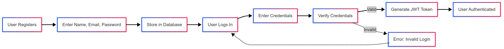
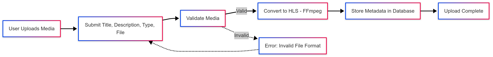
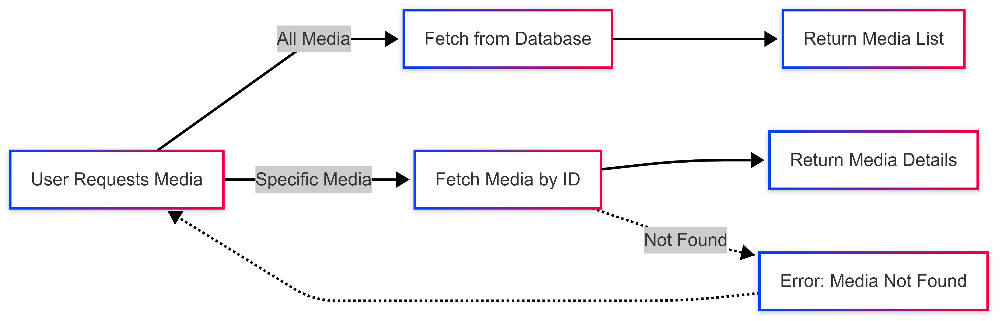
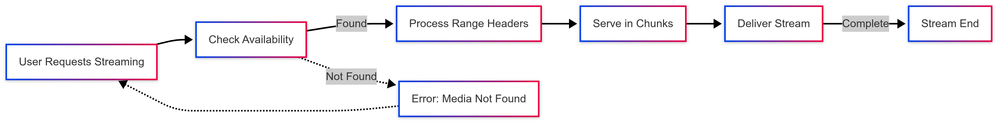
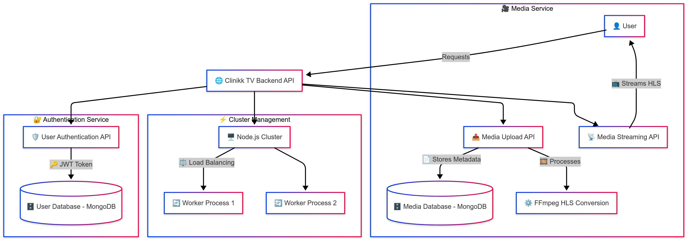

# Stream Backend Service (Submission for Clinikk)

## Table of Contents

- [Introduction](#introduction)
- [File Structure](#file-structure)
- [Flow of Media API](#flow-of-media-api)
- [API Documentation](#api-documentation)
  - [User Endpoints](#user-endpoints)
  - [Media Endpoints](#media-endpoints)
- [Libraries Used](#libraries-used)
- [Setup and Installation](#setup-and-installation)
- [Running the Project](#running-the-project)
- [Testing](#testing)
- [Middleware Functionality](#middleware-functionality)
- [Automation Testing Procedure](#automation-testing-procedure)
- [FFmpeg-based Media Conversion](#ffmpeg-based-media-conversion)
- [Streaming Service](#streaming-service)
- [Cluster-Based Performance Optimization](#cluster-based-performance-optimization)
- [Diagrams](#diagrams)

## Introduction

Clinikk TV is a new feature on our customer-facing platform (Android app and PWA) that provides subscribers with access to rich, health-related media content, including both video and audio. This backend service is designed to manage user authentication, media content management, and streaming.

## File Structure

```
clinikk-tv-backend
├── controllers
│   ├── mediaController.js
│   └── userController.js
├── models
│   ├── Media.js
│   └── User.js
├── routes
│   ├── media.js
│   └── user.js
├── middleware
│   └── authMiddleware.js
├── services
│   ├── ffmpegService.js
│   ├── streamService.js
├── utils
│   ├── logger.js
│   ├── cluster.js
├── tests
│   ├── user.test.js
│   ├── media.test.js
├── app.js
├── config.js
├── .env
```

## Middleware Functionality

### Authentication Middleware (authMiddleware.js)
The authentication middleware is used to protect routes that require user authentication.

- **Functionality:**
  - Extracts the JWT token from the request headers.
  - Verifies the token using the secret key.
  - Attaches the decoded user information to the request object.
  - If the token is missing or invalid, the request is denied with an appropriate response.

- **Usage:**
  - Applied to protected routes, such as media upload and streaming, to ensure only authenticated users can access them.

## Flow of Media API

The media API flow includes the following steps:

### User Registration and Login:

- Users register with their name, email, and password.
- Users log in with their email and password to receive a JWT token for authentication.

### Media Upload:

- Users upload media files, providing details such as title, description, media type, and file path.
- The media file is converted to HLS format using FFmpeg.
- The media details are saved in the database.

### Fetching Media:

- Users can fetch all media or specific media by ID.
- The media details are retrieved from the database and returned in the response.

### Media Streaming:

- Users can stream media files by ID.
- The media file is read and streamed in chunks to the client.


## Flow Diagrams

Below are the flow diagrams representing different aspects of the Media API:

### User Registration and Login
This diagram illustrates the process of user authentication, including registration and login, where users receive a JWT token upon successful authentication.



### Media Upload
This diagram details the steps involved in uploading media files, processing them with FFmpeg, and storing their metadata in the database.



### Fetching Media
This diagram represents how media details are retrieved from the database and returned to the client upon request.



### Media Streaming
This diagram shows how media files are served in chunks to users, optimizing performance and ensuring smooth playback.



## Setup and Installation

1. Clone the repository:
   ```sh
   git clone https://github.com/your-repository/clinikk-tv-backend.git
   cd clinikk-tv-backend
   ```
2. Install dependencies:
   ```sh
   npm install
   ```
3. Create a `.env` file in the root directory and add the following variables:
   ```env
   MONGO_URI=your_mongodb_connection_string
   JWT_SECRET=your_jwt_secret
   ```
   These values will be imported from `config.js`.

4. Start the server:
   ```sh
   npm start
   ```
   Or with nodemon for live reload:
   ```sh
   npm run dev
   ```

## API Documentation

### User Endpoints

#### Register a New User

**Endpoint:** `POST /api/users/register`

**Request Body:**

```json
{
    "name": "Test User",
    "email": "test@example.com",
    "password": "123456"
}
```

**Headers:**

```json
{
    "Content-Type": "application/json"
}
```

#### Login a User

**Endpoint:** `POST /api/users/login`

**Request Body:**

```json
{
    "email": "test@example.com",
    "password": "123456"
}
```

**Headers:**

```json
{
    "Content-Type": "application/json"
}
```

**Expected Response:**

```json
{
    "token": "your_jwt_token_here"
}
```

### Media Endpoints

#### Get All Media

**Endpoint:** `GET /api/media`

**Headers:**

```json
{
    "Content-Type": "application/json",
    "Authorization": "Bearer your_jwt_token_here"
}
```

#### Upload New Media

**Endpoint:** `POST /api/media`

**Request Body:**

```json
{
    "title": "Test Media",
    "description": "Description of Test Media",
    "media_type": "video",
    "file_path": "/path/to/file",
    "uploaded_by": "Test User"
}
```

**Headers:**

```json
{
    "Content-Type": "application/json",
    "Authorization": "Bearer your_jwt_token_here"
}
```

#### Stream Media by ID

**Endpoint:** `GET /api/media/stream/:id`

**Headers:**

```json
{
    "Authorization": "Bearer your_jwt_token_here"
}
```

## FFmpeg-based Media Conversion

The media conversion service uses **FFmpeg** to convert uploaded video files into **HLS (HTTP Live Streaming) format** for adaptive bitrate streaming.

- **Functionality:**
  - Converts input video files into `.m3u8` HLS format.
  - Splits the video into segments for optimized streaming.
  - Ensures compatibility across different devices.
  
- **Implementation:**
  - Uses `fluent-ffmpeg` to process media files.
  - Stores processed media in a dedicated output directory.

## Streaming Service

The streaming service handles the efficient delivery of media content to users.

- **Functionality:**
  - Streams media files using chunked transfer encoding.
  - Supports range-based streaming to allow seeking within videos.
  - Ensures secure delivery with authentication checks.
  
- **Implementation:**
  - Uses `fs` (File System) module to read and send media chunks.
  - Implements `pipeline` from Node.js streams for optimized data transfer.

## Cluster-Based Performance Optimization

The application is optimized using **Node.js clustering** to utilize multiple CPU cores for handling requests efficiently.

- **Functionality:**
  - Distributes incoming requests across multiple worker processes.
  - Automatically restarts failed workers for resilience.
  - Enhances scalability and performance for concurrent users.
  
- **Implementation:**
  - Uses `cluster` and `os` modules to spawn worker processes.
  - Logs worker activity and automatically recovers from failures.

## Automation Testing Procedure

The project includes automated tests for User and Media APIs. These tests ensure that endpoints function correctly and validate the expected behavior.

### Running Tests

To execute the test suite, run the following command:
```sh
npm test
```
This command runs all test files under the `tests/` directory.

### User API Tests
- Tests user registration and login functionality.
- Ensures successful token generation after login.
- Verifies authentication mechanisms.

### Media API Tests
- Tests media upload, retrieval, and streaming.
- Ensures media is correctly stored and processed.
- Validates token authentication for media access.

The test files are located in the `tests/` directory:
- `user.test.js` for user-related tests.
- `media.test.js` for media-related tests.

## High-Level Design Diagram

The following **High-Level Design (HLD) Diagram** illustrates the overall architecture of the Clinikk TV backend service:




## Ownership

This project is created by Deepanshu Chauhan
deepanshuchauhan483@gmail.com
